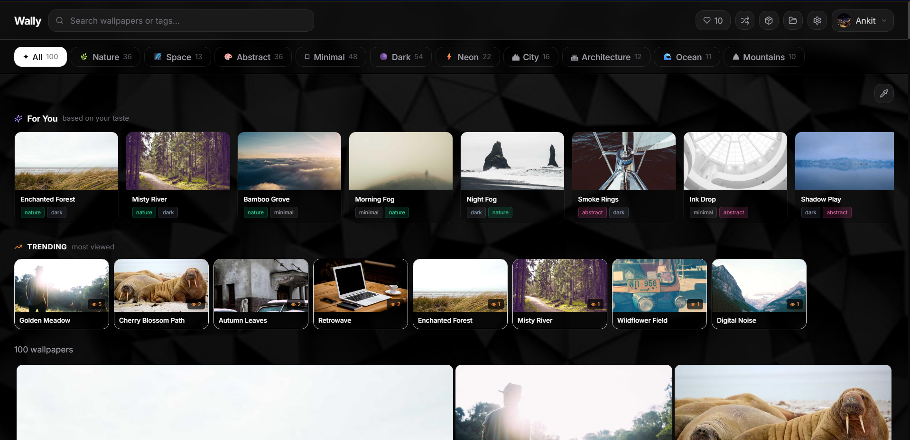
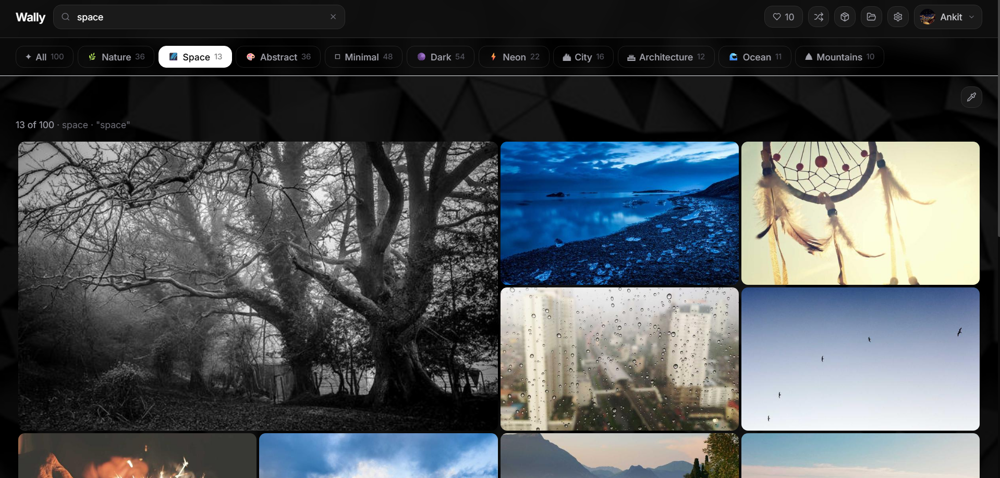
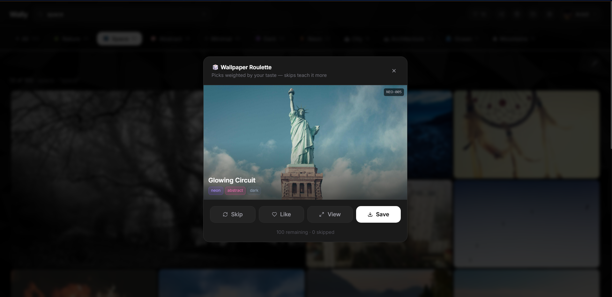
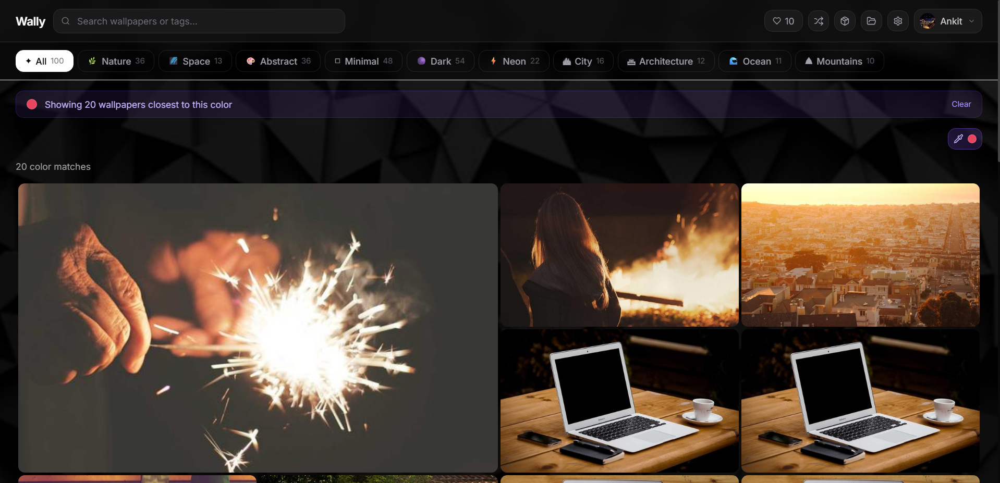
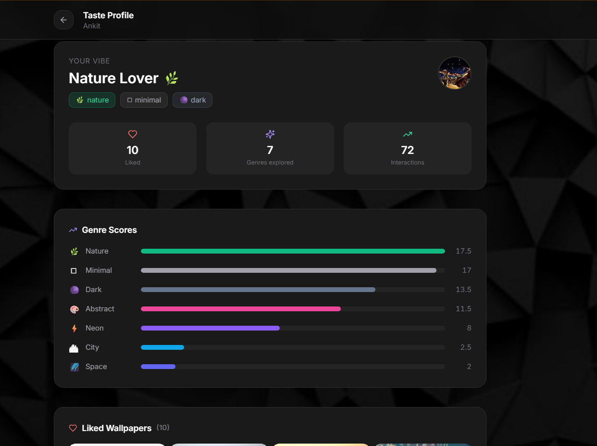
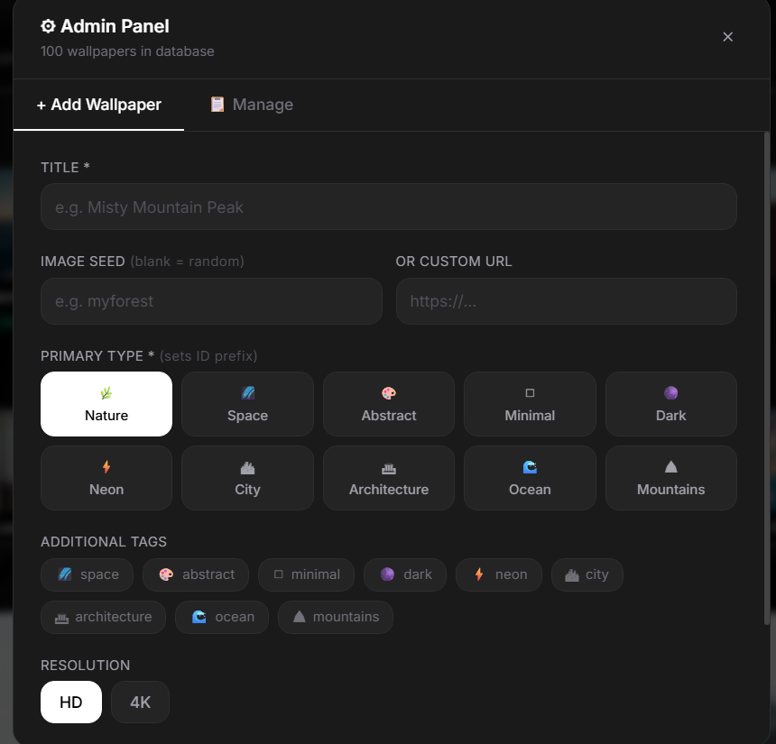

# Wally - AI-Powered Wallpaper Gallery

I got tired of wallpaper sites that show you the same generic grid every time, with no memory of what you actually like. So I built Wally - a full-stack wallpaper gallery that pays attention to what you click, like and download and slowly builds a taste profile around it. It's got colour-based search, shareable collections, a "roulette" mode for random discovery and an admin panel to manage the catalog - all running locally with a React frontend and a Node/Express backend.

The core idea: every interaction (view, like, download, skip) feeds a scoring engine that ranks wallpapers by how close they are to your taste, so the longer you use it, the more it feels curated for you specifically instead of just being a static gallery.



---

## The problem I was trying to solve

Most wallpaper sites have the same issues:

- Everyone sees the same generic gallery - no personalisation at all
- No way to search by colour or mood, just tags/categories
- Likes and preferences don't persist between sessions
- No curated packs based on what you actually like
- Zero insight into your own aesthetic preferences over time

Wally tries to fix this with real-time interaction tracking, a tag-weighted scoring system and cloud-synced profiles via Firebase.

---

## What it does

### Gallery & discovery
100+ wallpapers spread across 10 genres - Nature, Space, Abstract, Minimal, Dark, Neon, City, Architecture, Ocean, Mountains. Each wallpaper carries multiple tags rather than being locked to one category, so it shows up in more relevant places. The grid is a responsive masonry layout with a couple of featured 2×2 hero cards up top, a genre filter bar with live counts and full-text search across titles and tags. Cards have a hover animation (pop-lift + zoom + gradient overlay) and the background does a subtle parallax scroll independent of the content.



### AI recommendations
This is the part I spent the most time on. Every interaction gets weighted:

| Action | Weight |
|---|---|
| Download | +3 |
| Like | +2 |
| View | +0.5 |
| Unlike | −2 |
| Roulette skip | −1 |

These scores accumulate per-user in Firestore and update in real time. Once you've interacted with enough wallpapers, a "For You" strip appears above the main grid - it doesn't show up immediately since there isn't enough signal yet to make it useful.

### Wallpaper roulette
A "surprise me" mode - random picks weighted so genres you already like show up more often, but you still get pulled outside your usual taste occasionally. You can skip, like, view, or save straight from the roulette modal and skipping actively teaches the engine what to avoid next time. It tracks how many you've skipped and how many are left in the pool.



### Custom 9-Pack
An auto-generated set of 9 wallpapers ranked by your taste score. You can refresh the whole set at once, or hover a single card to swap out just that one (there's a little flash animation to confirm the swap). The footer shows how many unused candidates are still available in the pool.

### Colour palette search
Pick a colour with the native colour picker, type in a hex code, or grab one of 15 preset swatches. Under the hood this runs canvas-based k-means clustering to extract the dominant palette from every wallpaper, then sorts results by RGB distance so the closest matches come first. There's a live progress bar while it scans, since this isn't instant across 100+ images.



### Taste profile page
A full dashboard, reachable from the user menu, that shows a computed "vibe label" based on your dominant genre (things like "Neon Dreamer" or "Nature Lover"), genre score bars and stats like total likes, genres explored and total interactions - plus a grid of everything you've liked. All computed live off the Firestore tag scores, not cached.



### Collections
Create named collections, add wallpapers to them from a card hover or the modal and toggle any collection between private and public. Public collections get a shareable link with a unique slug. You can rename inline, expand to preview thumbnails and delete with one click.

### Likes & saved wallpapers
Like from the card hover, the modal, or roulette. If you're signed in, likes persist in Firestore; if not, they're stored in localStorage and get merged into your Firestore profile the first time you log in - so you don't lose anything by trying it out logged-out first. There's also a slide-in drawer for quickly browsing/removing liked wallpapers.

### Device preview
Preview any wallpaper inside a phone, tablet, or desktop frame before downloading, so you can actually see how it'll look instead of guessing.

### Smart download
Choose your resolution - Mobile (1080×1920), HD (1920×1080), or 4K (3840×2160) - via seed-based URL transforms. Every download counts toward your taste score, whether you download from the card, modal, roulette, or 9-pack.

### Trending row
Shows the most-viewed wallpapers for the current session, updating live as people open them. Only shows up when there's no active filter or search, so it doesn't clutter a focused view.

### Authentication
Email/password and Google one-tap sign-in, both via Firebase Auth. Error messages are written to actually be useful instead of generic Firebase error strings. Your avatar and display name show up in the header dropdown and signing out clears your session but keeps local likes intact.

### Admin panel
Add wallpapers by picsum seed or a custom URL, set a primary type (which determines the smart ID prefix - e.g. `NAT-011`, `SPC-004`) and add extra tags. There's a live seed preview before you commit, plus search/browse/delete for existing wallpapers, with view counts shown per entry.



### Security
Firestore rules restrict users to reading/writing their own data. Public collections are readable by anyone; private ones are owner-only. Firebase ID tokens are verified on every protected route.

---

## Architecture

```
Browser (React)
        │
        ▼
  Vite Dev Server
        │
        ├── /api/* ──────────────────────► Node + Express API (port 3001)
        │                                         │
        │                                         ├── GET  /api/wallpapers
        │                                         ├── POST /api/wallpapers
        │                                         ├── DELETE /api/wallpapers/:id
        │                                         └── PATCH /api/wallpapers/:id/view
        │                                                │
        │                                         wallpapers.json (flat-file DB)
        │
        ├── Firebase Auth ─────────────► Email / Google sign-in
        │
        ├── Firestore ─────────────────► users (likes, tagScores)
        │                                collections (named, public/private)
        │
        ├── Recommendation Engine ─────► tag-score × wallpaper-tags → ranked list
        │
        ├── Colour Search ─────────────► canvas → k-means palette → RGB distance sort
        │
        └── picsum.photos CDN ─────────► wallpaper images (seed-based, no API key)
```

I went with a flat JSON file instead of a real database for the wallpaper catalog - it's a personal project and I wanted to skip the DB setup overhead. If this ever needed to scale past a hobby project, that'd be the first thing to swap out.

---

## Tech stack

**Frontend**
- React 18
- Vite 8
- Tailwind CSS 3
- Lucide React (icons)
- React Router DOM

**Backend**
- Node.js
- Express
- CORS
- Flat JSON file database (`wallpapers.json`)

**Auth & database**
- Firebase Authentication (Email + Google)
- Cloud Firestore

**Image & colour**
- picsum.photos (free seeded image CDN, no API key needed)
- Canvas API + k-means clustering for palette extraction
- Colorthief

**Dev tools**
- Concurrently (runs frontend + backend together)
- kill-port (clears port 3001 automatically on restart, since I kept forgetting to kill it manually)

---

## Getting it running

### 1. Clone it

```bash
git clone https://github.com/yourusername/wally.git
cd wally
```

### 2. Set up Firebase

1. Go to [console.firebase.google.com](https://console.firebase.google.com)
2. Create a new project
3. Enable **Authentication** → Email/Password + Google
4. Enable **Firestore Database** → start in test mode
5. Project Settings → Web app → copy your config object

### 3. Add your Firebase config

Create `client/src/firebase.js`:

```js
import { initializeApp }              from 'firebase/app'
import { getAuth, GoogleAuthProvider } from 'firebase/auth'
import { getFirestore }               from 'firebase/firestore'

const firebaseConfig = {
  apiKey:            "YOUR_API_KEY",
  authDomain:        "YOUR_AUTH_DOMAIN",
  projectId:         "YOUR_PROJECT_ID",
  storageBucket:     "YOUR_STORAGE_BUCKET",
  messagingSenderId: "YOUR_MESSAGING_SENDER_ID",
  appId:             "YOUR_APP_ID",
}

const app = initializeApp(firebaseConfig)
export const auth           = getAuth(app)
export const db             = getFirestore(app)
export const googleProvider = new GoogleAuthProvider()
```

### 4. Install root dependencies

```bash
npm install
```

### 5. Install client dependencies

```bash
cd client
npm install
cd ..
```

---

## Running it

```bash
npm run dev
```

This spins up both servers:

```
Port 3001 cleared
[0]  Wally API → http://localhost:3001
[1]  VITE v8.x  →  http://localhost:5173
```

Open `http://localhost:5173`.

---

## How to use it

1. Launch with `npm run dev`
2. Browse the 100 wallpapers across 10 genres
3. Click any wallpaper to open the full preview modal
4. Like, download, or save it to a collection
5. Sign in with Google or email to sync your likes across devices
6. Try the colour picker to find wallpapers matching a specific palette
7. Hit the roulette button when you want something unexpected
8. After a few interactions, the "For You" strip will show up with personalised picks
9. Open the 9-Pack from the header for a curated set based on your taste
10. Check your Taste Profile for a breakdown of your visual preferences
11. Create named collections and share them publicly via link

---

## Project structure

```
wallpaper-app/
│
├── client/                          # React frontend
│   ├── public/
│   │   └── bg.jpeg                  # Parallax background image
│   └── src/
│       ├── components/
│       │   ├── AdminPanel.jsx        # Add / remove wallpapers
│       │   ├── AuthModal.jsx         # Sign in / sign up modal
│       │   ├── CollectionModal.jsx   # Add wallpaper to collection
│       │   ├── CollectionPanel.jsx   # View and manage collections
│       │   ├── ColorSearch.jsx       # Colour palette picker + search
│       │   ├── FilterBar.jsx         # Genre filter tabs
│       │   ├── Header.jsx            # Top nav bar
│       │   ├── LikedPanel.jsx        # Liked wallpapers drawer
│       │   ├── Pack.jsx              # Custom 9-pack modal
│       │   ├── RecommendedRow.jsx    # For You personalised strip
│       │   ├── Roulette.jsx          # Random wallpaper discovery
│       │   ├── TrendingRow.jsx       # Most viewed wallpapers
│       │   ├── WallpaperCard.jsx     # Grid card with hover actions
│       │   ├── WallpaperGrid.jsx     # Responsive masonry grid
│       │   └── WallpaperModal.jsx    # Full preview + download modal
│       │
│       ├── contexts/
│       │   └── AuthContext.jsx       # Firebase auth + Firestore likes + tag scores
│       │
│       ├── hooks/
│       │   ├── useCollections.js     # Firestore collections CRUD
│       │   └── useRecommendations.js # Tag-score recommendation engine
│       │
│       ├── pages/
│       │   └── TasteProfile.jsx      # Taste profile dashboard page
│       │
│       ├── utils/
│       │   └── colorUtils.js         # k-means palette extraction + RGB distance
│       │
│       ├── App.jsx                   # Root component
│       ├── firebase.js               # Firebase config
│       ├── index.css                 # Tailwind + card animations
│       └── main.jsx                  # React entry point
│
├── data/
│   └── wallpapers.json              # Flat-file wallpaper database (100 entries)
│
├── package.json                     # Root scripts (dev, server, client)
└── server.js                        # Express API + smart ID generator
```

---

## Firestore security rules

```
rules_version = '2';
service cloud.firestore {
  match /databases/{database}/documents {
    match /users/{userId} {
      allow read, write: if request.auth != null && request.auth.uid == userId;
    }
    match /collections/{colId} {
      allow read: if resource.data.isPublic == true
                  || (request.auth != null && request.auth.uid == resource.data.ownerId);
      allow create: if request.auth != null;
      allow update, delete: if request.auth != null
                             && request.auth.uid == resource.data.ownerId;
    }
  }
}
```

---

## Known limitations / things I'd improve

- The wallpaper "database" is a flat JSON file - fine for 100 entries, wouldn't scale much further without moving to a real DB
- Colour palette scanning runs client-side, so the first scan across the full gallery takes a few seconds
- No pagination yet on the admin panel's wallpaper list

---

## Contributing

Contributions, suggestions and improvements are welcome.

- Fork the repository
- Create a feature branch
- Commit your changes
- Push to your branch
- Submit a pull request
